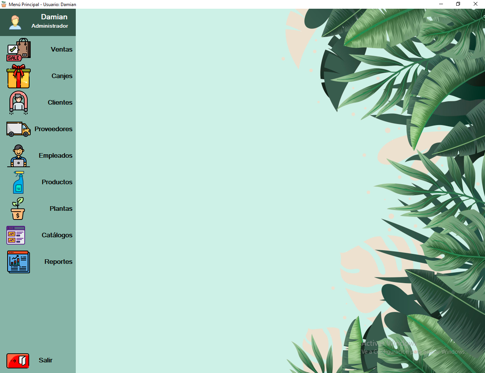
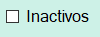
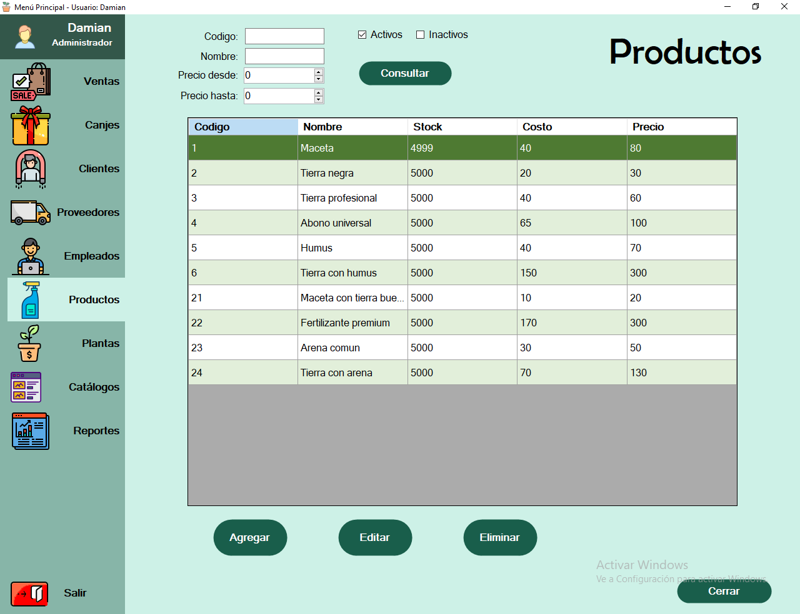
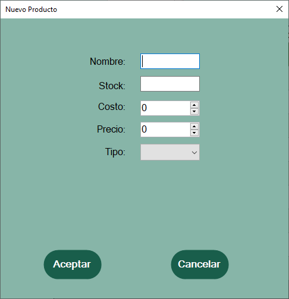
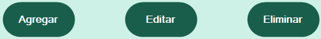
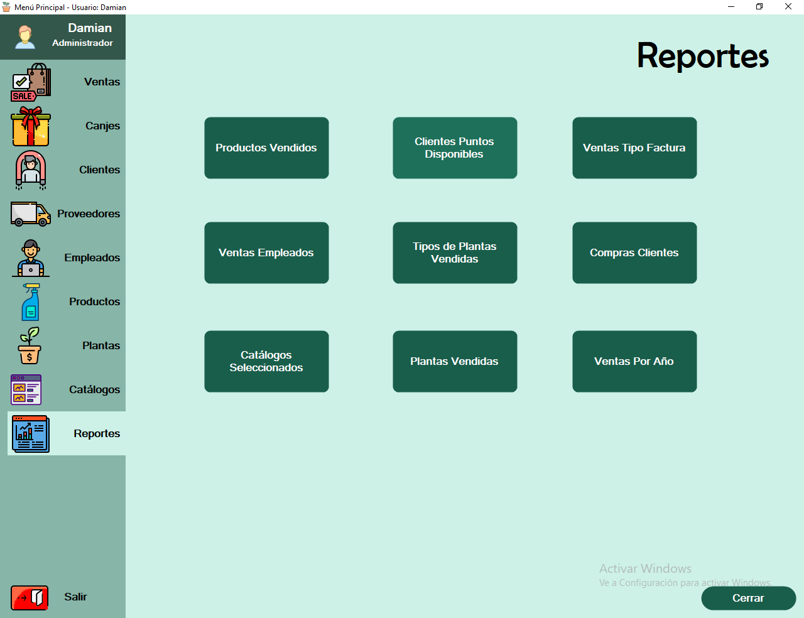

{width="1.5729166666666667in"
height="1.5729166666666667in"}

***"La Cone"***

MANUAL DE USUARIO

**Profesores:**

-   Romero, María Soledad

-   Figueroa, Rodolfo

-   Botta, Oscar Ernesto

**Curso:** 3K1 **Grupo:** N.º 10

**Autores:**

-   Casas Gonzalo 81960,

-   Hidalgo Nicolas 78934,

-   Quinteros Damian 82599,

-   Yanguez Stephan 78787

Bienvenido al Manual de uso básico de la aplicación *La Cone*

*La aplicación desarrollada denominada "La Cone" es un software que
lleva adelante la administración y control de ventas de productos de
viveros por los usuarios. Tiene la función de gestionar datos, que
permiten realizar un seguimiento detallado de cada uno de los procesos
llevados adelante por los mismos. La Cone, tiene la facultad de agregar,
Productos, Proveedores, Plantas, Categorías y clientes. A su vez, nos
permitirá emitir reportes para la toma de decisiones a futuro que ayuden
a la organización.*

*Los administradores van a ser los encargados de gestionar las
transacciones que se realizan y poder habilitar, modificar, eliminar
distintos elementos que aparecen en el sistema. A su vez también pueden
consultarlos, inscribir clientes y seguir el avance de los mismos.*

Contenido

I.  INTRODUCCIÓN\...\...\...\...\...\...\...\...\...\...\...\...\...\...\...\...\...\...\...\...\...\...\...\...\...\...\...\...\...\...\...\...\...\...\...\...\...\...\.....4

> 1\.
> OBJETIVO\...\...\...\...\...\...\...\...\...\...\...\...\...\...\...\...\...\...\...\...\...\...\...\...\...\...\...\...\...\...\...\...\...\...\...\...\...\...\...\...\.....4
>
> 2\.
> ALCANCES\...\...\...\...\...\...\...\...\...\...\...\...\...\...\...\...\...\...\...\...\...\...\...\...\...\...\...\...\...\...\...\...\...\...\...\...\...\...\...\...\....4

II. OPCIONES DEL
    SISTEMA\...\...\...\...\...\...\...\...\...\...\...\...\...\...\...\...\...\...\...\...\...\...\...\...\...\...\...\...\...\...\...\...\...\...\....4

1\. INICIO DE
SESIÓN\...\...\...\...\...\...\...\...\...\...\...\...\...\...\...\...\...\...\...\...\...\...\...\...\...\...\...\...\...\...\...\...\...\...\...\...\.....5

2\. MENÚ PRINCIPAL
\...\...\...\...\...\...\...\...\...\...\...\...\...\...\...\...\...\...\...\...\...\...\...\...\...\...\...\...\...\...\...\...\...\...\...\...\....5

a\.
Ventas\...\...\...\...\...\...\...\...\...\...\...\...\...\...\...\...\...\...\...\...\...\...\...\...\...\...\...\...\...\...\...\...\...\...\...\...\...\...\...\.....6

b\.
Productos\...\...\...\...\...\...\...\...\...\...\...\...\...\...\...\...\...\...\...\...\...\...\...\...\...\...\...\...\...\...\...\...\...\...\...\...\...\.....8

c\.
Reportes\...\...\...\...\...\...\...\...\...\...\...\...\...\...\...\...\...\...\...\...\...\...\...\...\...\...\...\...\...\...\...\...\...\...\...\...\...\...\...10

d\.
Salir\...\...\...\...\...\...\...\...\...\...\...\...\...\...\...\...\...\...\...\...\...\...\...\...\...\...\...\...\...\...\...\...\...\...\...\...\...\...\...\...\....12

III\. CONCLUSIÓN
...................................................................................................................................13

I.  Introducción

1\. [Objetivo]{.underline}

Brindar información para la gestión y comercialización de plantas y
productos afines a la empresa.

2\. [Alcances]{.underline}

-   Registrar clientes

-   Registrar proveedores

-   Registrar ventas

-   Registrar productos

-   Controlar stock

-   Gestionar beneficios de clientes

-   Registrar cobros

-   Generar y emitir factura

-   Generar reportes

II. Opciones del Sistema

El presente Manual está organizado de acuerdo con la secuencia de
ingreso al sistema:

1\. Inicio de sesión

2\. Menú principal

a\. Ventas.

b\. Productos.

c\. Reportes

d\. Salir

1.  [Inicio de Sesión]{.underline}

En esta ventana, el usuario debe colocar su Nombre de Usuario,
Contraseña y presionar el botón Ingresar, tal como se muestra a
continuación (Se recomienda ingresar con el Usuario: "1" Contraseña:
"12").

{width="3.6663385826771653in"
height="1.968503937007874in"}

2.  [Menú Principal]{.underline}

Una vez ingresada la sesión con éxito, la pantalla de inicio de la
aplicación se muestra al usuario ingresado y los siguientes datos:

{width="6.14582895888014in"
height="4.724409448818897in"}

El menú principal está conformado por un menú lateral izquierdo, el cual
da la accesibilidad a las diferentes funcionalidades del sistema, a
fines prácticos se documentará la utilización de las funcionalidades de
ventas, productos y reportes.

A continuación, se analizarán los botones del menú lateral:

a.  Ventas.

Al seleccionar el botón *Ventas* se desplegará un submenú con el
siguiente contenido:

{width="6.1455544619422575in"
height="4.724409448818897in"}

Con el botón *consultar* obtenemos las facturas que el sistema ingreso
pudiendo filtrarlas de acuerdo a: N.º de Factura, documento del cliente,
empleado que registro la factura y fecha de ingreso.

{width="1.0416666666666667in"
height="0.20833333333333334in"}Se podrá consultar aquellas facturas que
tuvieron que ser anuladas en .

En la sección Detalle de factura se mostrarán los ítems de cada factura
seleccionada.

Al anular una factura se debe seleccionar previamente y oprimir el botón
*Anular*.

Vale mencionar que todas las opciones contarán con el botón *Cerrar* que
permitirá volver hacia atrás en todas las opciones.

Con el botón *agregar* se desplegará una ventana como la siguiente:

{width="6.1491305774278215in"
height="3.543307086614173in"}

Aquí podremos agregar la venta realizada especificando el tipo de
factura, el cliente asociado (al elegir el cliente se mostrará los datos
del mismo) y la fecha de registro.

{width="0.2in"
height="0.20833333333333334in"}{width="0.22916666666666666in"
height="0.22152777777777777in"}Podremos seleccionar aquellos productos o
plantas que tendrá la factura con su respectiva cantidad, precio e
importe, una vez finalizado seleccionar el botón para agregar el ítem
caso contrario seleccionar para quitar.

Luego Aceptar (caso contrario se puede cancelar en cualquier momento
previo).

{width="6.148052274715661in"
height="3.5409722222222224in"}

b.  Productos.

{width="6.1455544619422575in"
height="4.724409448818897in"}Al seleccionar el botón *Productos* se
desplegará un submenú con el siguiente contenido:

{width="1.0416666666666667in"
height="0.20833333333333334in"}Con el botón *consultar* obtenemos los
productos que el sistema ingreso pudiendo filtrarlas de acuerdo a:
Código del producto, Nombre y precio (desde - hasta).

Se podrá consultar aquellos productos que están inactivos con la opción
.

Vale mencionar que todas las opciones contarán con el botón *Cerrar* que
permitirá volver hacia atrás en todas las opciones.

Por otro lado, esta ventana cuenta con 3 botones en su margen izquierdo
inferior, los cuales se utilizarán para Agregar, Actualizar y
Deshabilitar un producto.

Al apretar cualquiera de los tres botones se abrirá:

{width="2.2805982064741905in"
height="2.3622047244094486in"} {width="2.2805982064741905in"
height="2.3622047244094486in"} {width="2.2805971128608924in"
height="2.3622047244094486in"}

{width="3.584244313210849in"
height="0.44251093613298337in"}

De esta manera se llevará a cabo la gestión de Productos, Agregando,
Actualizando o Deshabilitándolos. De la misma forma que los productos se
podrán hacer con *Clientes, Proveedores, Empleados, Plantas* y
*Catalogo*.

En caso de agregar o actualizar un producto de tipo compuesto se
desplegará la siguiente ventana:

{width="2.8906135170603675in"
height="3.65625in"}

En este caso seleccionar el componente que conforma al producto
compuesto con su cantidad correspondiente repitiendo el mismo las veces
que sean necesarios con el botón agregar y caso contrario con eliminar.
Luego *Aceptar* o caso contrario *Cancelar*.

c.  Reportes.

Al seleccionar el botón *Reportes* se desplegará un submenú con los
siguientes botones:

> {width="6.145138888888889in"
> height="4.7243055555555555in"}

A partir de estos botones se podrá obtener reportes y estadísticas de
distintas funciones del sistema.

Vale mencionar que todas las opciones contarán con el botón *Cerrar* que
permitirá volver hacia atrás en todas las opciones.

Comenzamos analizando el botón *Productos Vendidos*, al presionar este
se abrirá la siguiente ventana:

{width="6.1455544619422575in"
height="4.724409448818897in"}

En esta ventana podemos obtener reportes de los productos que se
vendieron en una fecha determinada, donde vamos a poder filtrar por
Fecha desde y Fecha Hasta. Como es el caso siguiente:

{width="3.6873337707786527in"
height="2.8346456692913384in"} {width="3.6873337707786527in"
height="2.8346456692913384in"}

Esta funcionalidad aplica también para los botones de *Ventas Tipo
Factura, Venta Empleados, Tipos de Plantas Vendidas, Catálogos
Seleccionados, y Plantas vendidas*.

Al seleccionar el botón *Clientes Puntos Disponibles*, se obtendrá una
estadística de la cantidad de clientes que poseen puntos disponibles
para canjear. La cual cuenta con filtros de fecha para obtener los datos
de un periodo determinado y Localidad. Esta funcionalidad aplica también
para el botón *Compras Clientes*.

{width="3.6873337707786527in"
height="2.8346456692913384in"} {width="3.6873337707786527in"
height="2.8346456692913384in"}

Por último, con el botón *Ventas Por Año* se obtiene la estadística de
la cantidad de ventas producidas en un año determinado y el ingreso que
se obtuvo en cada mes.

{width="3.6873337707786527in"
height="2.8346456692913384in"} {width="3.6873337707786527in"
height="2.8346456692913384in"}

d.  Salir.

{width="0.63125in"
height="0.20833333333333334in"}Para poder salir del sistema La Cone, es
necesario presionando el botón , y luego confirmar si se desea salir del
sistema o cerrar sesión.

{width="3.608923884514436in"
height="1.968503937007874in"}

III. CONCLUSIÓN

Durante el cursado de la materia PAV aprendimos a reconocer los
componentes que integran un proyecto de programación orientado a objetos
utilizando Visual Studio, empleando el lenguaje C#.

También pusimos a prueba las sentencias que aprendimos durante el
cursado de GDA, para insertar, recuperar y modificar datos de una base
de datos relacional.

Ejercitamos distintos métodos para el manejo de errores con el fin de
controlar el correcto funcionamiento de la aplicación desarrollada.

Otra de las cuestiones ejercitadas es la aplicación de programación en
capas con la finalidad de crear una aplicación mantenible (tres niveles
de capas)

Finalizando la materia reconocimos los componentes básicos para generar
reportes que sean útiles para la toma de decisiones, utilizando
diferentes filtros y parámetros de entrada para la generación de los
mismos.

